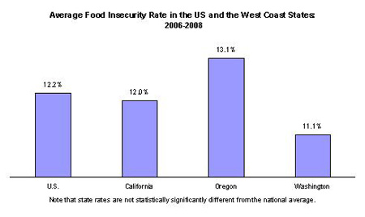

**INFO 201 FINAL PROJECT**

https://docs.google.com/document/d/1F7vgvRVfgNgIMLSuvXVlJBiP14CZIXyBqa_sJ3FOFss/edit

# Appendix - Part 1: Report Outline

## **"Food Availability in Washington State"**

#### Code Name: You Are What You Eat

#### Team Members:
* **Anna Bloch**
* **Hoa Le**
* **Jess Suresh**
* **Richard Dait**

#### 1.0 Introduction:
* 1.1 Problem Situation: **Our focus is on food trends in Washington state. To address this issue, we will look at food accessibility and the underlying inequities (i.e. income and class). The direct stakeholders are Washington residents who lack access to fresh food; whereas, indirect stakeholders are supermarkets, farmers, public interest groups and policymakers. What is at stake are the well-being of those directly impacted. A few values that are in play are exercising one's right to nutritious food, educating on inequities, servicing others and building a strong community. An ethics element that exist is, eating a healthy meal is a basic human right.**

* 1.2 What is the Problem? **According to the Dietary Guidelines 2015-2020 published by health.gov, around three-fourths of Americans lack proper nutrition. They do not eat a balanced diet that consists of fresh produce, lean meat, dairy, whole grains and healthy fats. One reason behind this is the limited access and sometimes, inavailability to grocery stores, farmers markets and health-food outlets. Whether it is a lack of income, transportation barrier or other socio-economic factor, residents who lack access to nutritious food that typically live in food deserts, tend to have a higher incidence of health related conditions such as diabetes, heart disease and obesity.**

* 1.3 Why Does It Matter? **Food is vital to human beings. Without food and its necessary nutrition, we cannot survive. The quality of what we consume, ultimately affects our health and overall quality of life. Therefore, it is imperative to acknowledge the ongoing issues related to food accessibility and availability. It directly impacts those underserved, stripping them access to nutritious food, possibly contributing to the rise in health-related problems. On the other hand, it indirectly affect all of us in some fashion. A well-informed public can lead to better solutions; thereby, prevent the problem from getting any bigger.**

* 1.4 How Will It be Addressed? **We decided to break the data down by looking at how socio-economic factors play into the variation of quality of food consumed. Our project will examine how big of a player location and lack of transportation are. In most food deserts, fast-food restaurants outnumber grocery stores by a wide margin. This could explain why health related issues are abnormally high in these communities. Another culprit is race. A person's racial background may shine light on this matter. Lastly, we will look into income/affordability and what part it plays in the quality of food consumed by residents living in food deserts.**

#### 2.0 Research Questions:
* Question 1: What is the food and nutrient availability for consumption in Washington State, compared to the rest of the nation?
* Question 2: How do socio-economic factors (location, income, race, ethnicity, etc.) contribute to food accessibility?

#### 3.0 Possible Data Sets:
* Data Set #1: Fruit and Vegetable Availability (Per Capita)
  - Description: Food availability data include estimates for over 200 commodities, including individual fruits, vegetables, grains, added sugars & sweeteners, dairy products, nuts, meat, poultry, and seafood. However, due to the nature of this project theme, we will only include the data that includes fruit and vegetables, considering they are fresh groceries and not everyone has the access to these products.
  - Link: https://www.ers.usda.gov/data-products/food-availability-per-capita-data-system/
  - Numbers of Observations and Attributes: 800 observations with 18 attributes.
* Data Set #2:
  - Description: Food Access Research Atlas, showing food access based on different attributes.
  - Link: https://www.ers.usda.gov/data-products/food-access-research-atlas/download-the-data/#Current%20Version
  - Numbers of Observations and Attributes: 72865 Observations, 66 Attributes.

#### 4.0 Information Visualization:

*Fig 1: "At times during the year, these households were uncertain of having, or unable to acquire, enough food to meet the needs of all their members because they had insufficient money or other resources for food. Food-insecure households include those with low food security and very low food security."*

*Fig 2: "Based on research done at the University of Washington, the national rate for food insecurity is 12.2%, while in Washington State it is 11.1% showing the large number of households struggling with food insecurity in the state and how it compares to the national average, where there is no great difference."

#### 5.0 Team Coordination:
* The group decided to meet either every Sunday from 7 p.m. - 9 p.m. on campus, or whenever possible. In addition, we will use video calls on Google Hangout as a means of collaborating. Another way of communicating is through text chat.
* Contributions:
  
Anna Bloch: Since previously I have done a research on the dieting trends of United States, I have some insights onto how to go about the research. Hopefully, I will be able to help our team analyzing the data in a more efficient way.
  
Hoa Le: I think this is a very interesting idea considering Washington is a relatively healthy state by a sheer look through Seattle dietary. However, with a more concrete set of data, our team can offer an alternative look.
  
Jess Suresh: I have a lot of ideas and interests in current ongoing food waste problems in the United States. I am hoping to find a newer look from this project that could help resolving the food waste problems.
  
Richard Dait: My individual goals for the project are to improve on my programming skills, learn and apply data science methodology, ensure everyone is on the same page, utilize my strengths (i.e., research, writing, Math) and contribute as much as I can. My role would be a consummate team player.
* Since we have a set time to meet, each member is responsible to have all materials prepared before meeting time. In the case of a time conflict, we will use a website called When2Meet to schedule a new time within the week. Microsoft Teams is our primary source of communication; however, we exchanged phone numbers and emails, in the event a member becomes unavailable on Microsoft Teams. In an instance where there is a conflict, the group will find a mutual resolution.

#### 6.0 Questions or Comments for Teaching Team:
We hope to develop our elementary coding and research skills, as well as collaborate effectively as a group.

#### 7.0 References:
* Chapter 1 Key Elements of Healthy Eating Patterns. (n.d.). Retrieved from https://health.gov/dietaryguidelines/2015/guidelines/chapter-1/a-closer-look-inside-healthy-eating-patterns/.
* Key Statistics & Graphics. (2019, September 4). Retrieved from https://www.ers.usda.gov/topics/food-nutrition-assistance/food-security-in-the-us/key-statistics-graphics.aspx.
* Food Insecurity. (n.d.). Retrieved from https://depts.washington.edu/wcpc/food-insecurity.
